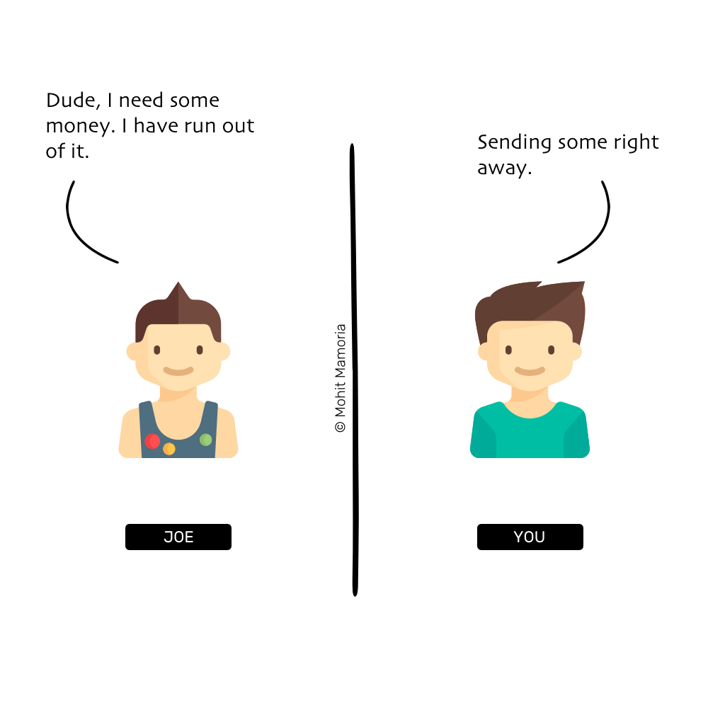
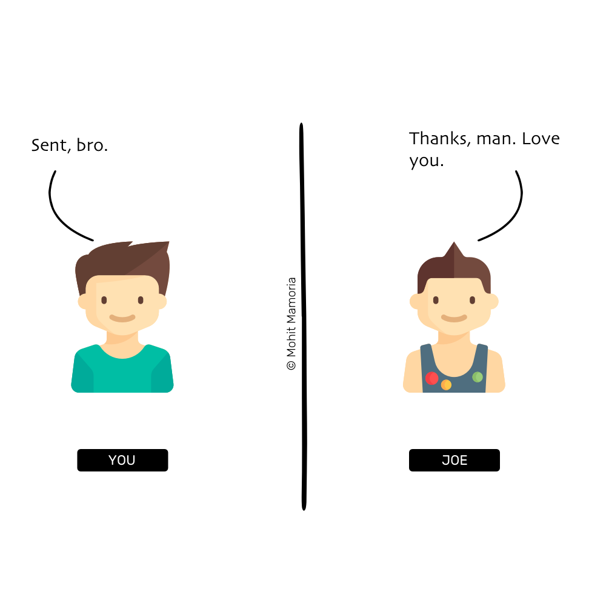
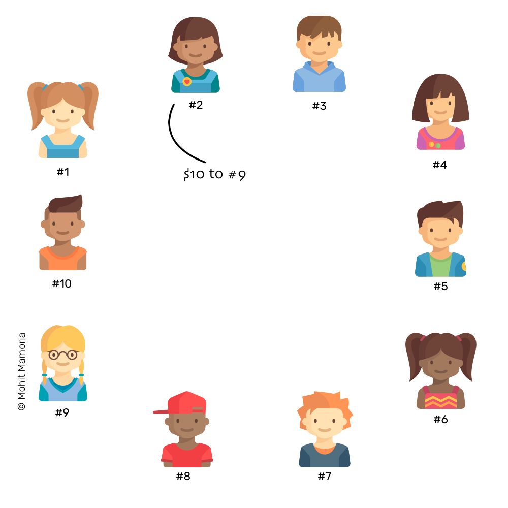
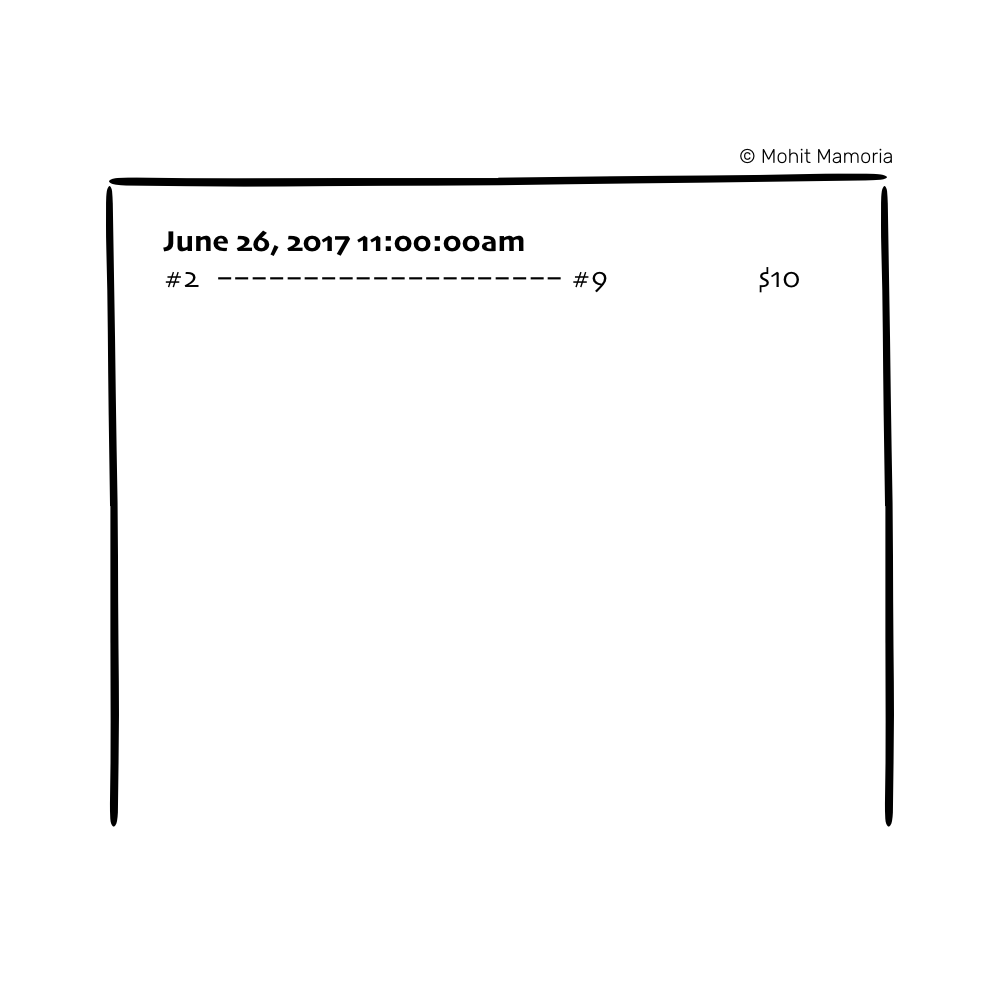
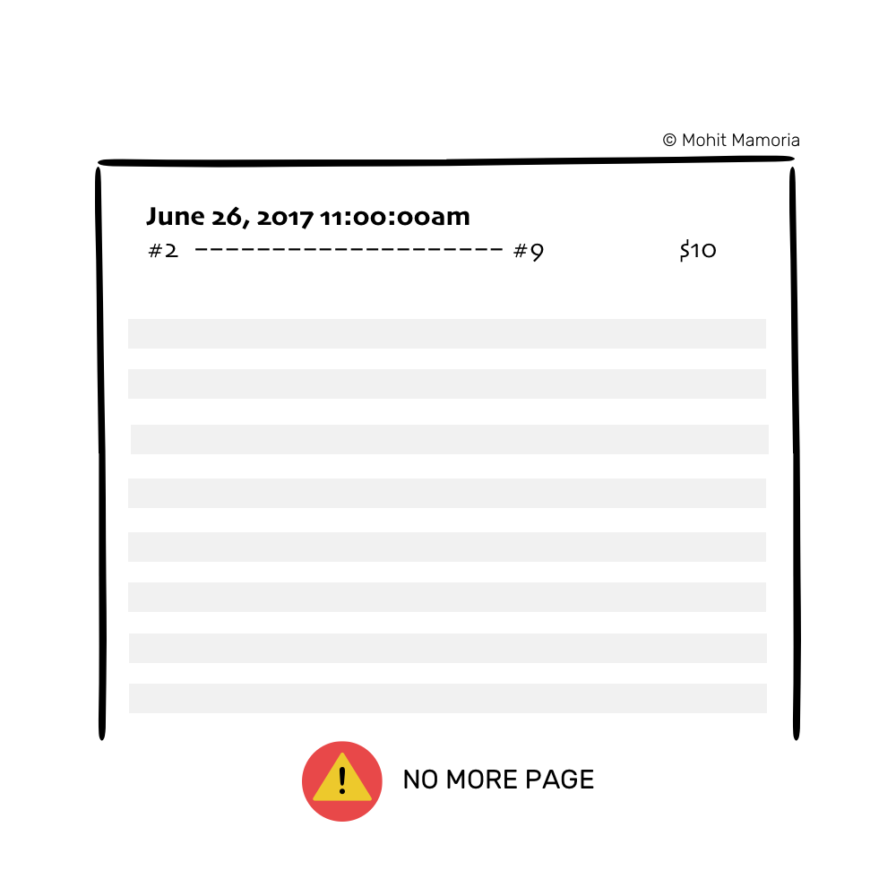
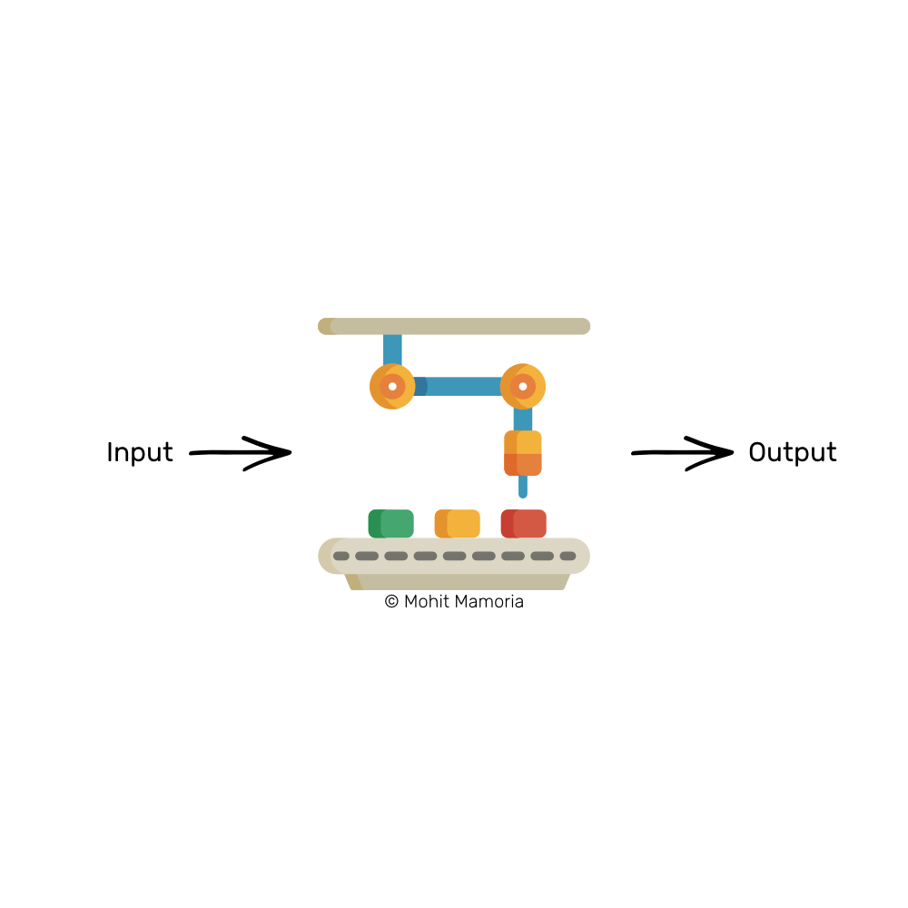
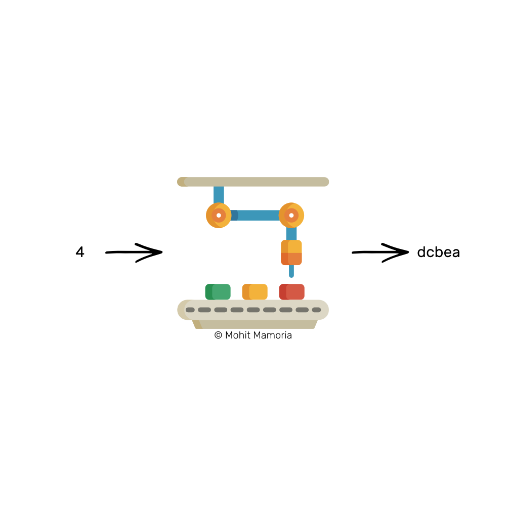

## 区块链是什么鬼？
*译自：[WTF is The Blockchain?](https://hackernoon.com/wtf-is-the-blockchain-1da89ba19348)*

*译者：王瑶*

通俗易懂的3500词英文指南让你理解区块链。
除非你与世隔绝，不然我敢肯定你听过比特币和区块链这两个名词。它是现今媒体最喜欢的话题和大势所趋，是今年的流行语。以至于从未“挖”过数字加密货币、不理解它怎样运作的人也在谈论它。我的朋友大多是非技术型而非技术型，他们求了我很长时间，让我把这个新流行语解释给他们听。我想应该有成千上万的人都像他们一样，而在这种时候，我理应写点让人们解答疑惑、指引方向的东西，也就是我现在所写的，这种可以让所有网民看懂的通俗文字。

**顺带一提，我是一家每周时事通讯，Unmade的负责人，为你的收件箱发送来自未来的想法。**

### 区块链：为什么我们需要这样复杂的东西？

“对于每个复杂的问题，都有一个看似简洁，实则错误的解答。” ——HL Mencken

与大部分你之前的读到的文章不同，上来就先给区块链下一个定义。我想先来说明白它可以帮我们解决的问题。

试想，乔是你最好的朋友。他在海外旅行，这是他假期的第五天，他打电话给你，说“杜德，我需要点钱。我的钱花完了。”

你回答：“我现在就寄给你。”，然后挂断电话。

于是你打电话给你银行的账户经理说：“请转给乔的账户1000美金。”

你的账户经理回答：“好的先生。”

他查询你的账户，查看你是否有足够多的账户余转1000美金给乔。你是一个富有的人，你有很多钱，因此，他这样在账本上写下：

***注意***：我们不是在讨论电脑，只为了让事情更简单。

你打电话给乔说：“我已经转了钱。下次你可以去银行取走我刚刚转给你的1000美金。”

刚刚发生了什么？你和乔都把钱交给银行管理。这里并不存在任何实际的金钱交换。需要的只是一个在
账本上的记录。更准确地说，是你和乔都不能掌控和拥有的账本记录。

这就是当前系统的问题所在。

*为了建立我们之间的信任，我们依赖于独立的第三方。*

依靠一个值得信赖的第三方，例如银行，有什么问题呢？

问题就在于，银行的数量有限。如果要引起社会的混乱，所需要的仅仅是一个人或一个组织的腐败，无论有意无意。

* 如果账本上的交易记录被删除会怎样?
* 如果你的账户经理不小心把1000美金写成了1500美金该怎么办？
* 如果他是成心那样做的呢？

*多年以来，我们把我们所有的鸡蛋都放在一个篮子里，同时也放在另一个人的篮子里。*

#### 是否可以有这样一个系统，我们仍然可以转钱，却不用通过银行？

为了回答这个问题，我们需要进一步研讨，并向自己提出一个更深入的问题。（毕竟问题越深入，答案越明确）。

稍微想想，转账的意义是什么？只是账本上的一笔。那么更好的问题自然是——是否存在这样一种方式，我们可以自己保留交易记录并自我保护？

现在，这是一个值得探讨的问题。答案你或许已经猜到了。区块链就是这个深刻问题的答案。

它是一个帮助我们更好地保护交易信息而不需要第三人来参与的方法。

我的话你能听懂吗？很好。现在，一些问题开始徘徊在你的脑海中，下面我们开始学习区块链是怎样运转的。

### 好，告诉我，它怎样运作？

首先，区块链的应用也是有前提的，它需要社会中有足够多的人相信这项科技，并且不想在交易中引入第三方。只有这样一群人，才可以维护各自的账户信息和安全。
那么问题来了，多少才算足够多呢？不多，最少3个人就够了。我们举个例子吧，有10个人都不再相信银行或其他第三方机构，于是互相达成协议，他们24小时互相拥有其他9个人的账户的进出信息（以数字密钥的形式），但并不包含账户主体的隐私细节，例如流水金额，姓名或者密码等。

#### 1.始于一个空文件夹
一开始每个人都有一个空的文件夹。当我们开始交易时，这10个个人账户会持续向这个空文件夹中增加页面。然后这个页面集合将形成跟踪交易的寄存器。

#### 2.当一笔交易发生时
然后，网络上的每个人的手里都会拿着一张
空白纸和一一支笔，每个人都做好了交易发生时做记录的准备。

例如，#2想转帐100元给#9，那么#2也需要告诉其余8个人，“我准备向9转账10美金，请大家在自己的文件上记录一下，谢谢啦。”

于是，其余8个人回去检查#2的账户余额里是否有足够的钱可以转给#9，如果有，交易会被执行，所有人也会在自己的文件上记录着交易的信息。

本页第一笔交易

这样交易就完成了。

#### 3.交易持续增长
随着时间的推移，网络上的人们有了更多的交易需求。当他们想要完成一笔交易他们会告诉其余的人，其余的人听到之后就会在他的页面上做一个记录。

这个步骤将会一直进行，直到每个人都用尽了当前页中的空白处。

这时候就要将这个页面封存到文件夹里，拿出新的一页，从步骤2开始做起。

#### 4.翻到新的一页之前
在我们翻到新的一页之前，要使用之前大家达成一致的密钥，对写满的这一页信息进行封装保护。通过封装，一旦信息被复制到每个人的文件夹里，我们可以确保没有人可以对其修改——今天不能、明天不能，甚至一年也不能。一朝在文件夹里，它就要生生世世待在文件夹里——被永久封存。此外，如果每个人都信赖封存技术，每个人就都信任文件里的内容。纸张的封装是这个方法的关键。

Jargon Box
这种保护页面的操作叫做“挖矿”。但是为了简单起见，我们把它称为“密封”。

早前，第三方（中间人）让我们相信他们写在账本上的记录不会被改变。而在像这样一个分布式和非集中式的系统中，封装给予我们信赖。

### 那么有趣的事情来了，我们怎么密封这些页面呢？
在我们学习怎样密封页面之前，我们要知道密封的原理。这是学习的先决条件。

#### 魔法机器
试想一台机器被厚厚的城墙包围。如果你把盒子里的东西从送进去，它会吐出一个盒子，里面装着别的东西。

Jargon Box
这台机器被叫做“哈希函数”，但是我们并不想技术性太强。所以今天，它们叫做“魔法机器”。

假设我们将数字“4”发送到这个机器，你会发现，他翻译出了“dcbea”。

这个机器是如何将“4”翻译成了这个字符串的呢？没有人知道。更重要的是，这是一个不可逆转的过程。给出'dcbea'，你不可能知道机器被输入了什么。再往机器回输“dcbea”，它不会再翻译出“4”。但是你每次输入4，都会翻译出同一个字符串。

你不可能因为知道输出的结果是'dcbea'而推理出之前向机器里输入了什么。但是每当你输入4，它就会翻译成同一个字符串'dcbea'。

 
